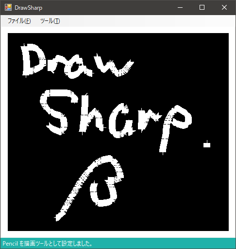

# DrawSharp
DrawSharp is  Drawing Application for C Sharp.

## DrawSharp is 何？
C# 製の簡易お絵描きアプリケーションです('ω')  
機能は、「対応機能」を参照ください。

## 対応機能
- 線描画
- 四角形描画
- 円系描画
- 塗りつぶし
- 消しゴム機能
- 全消し(対応中)
- 保存(今のところは.jpg のみ)  

## License for DrawSharp
- MIT License

## 使用した OS, IDE など
- OS
  - Windows 10 Home

- IDE  
  - Visual Studio 2017 Community (.NET Framework 4.6.1)  
  - SmartGit  
